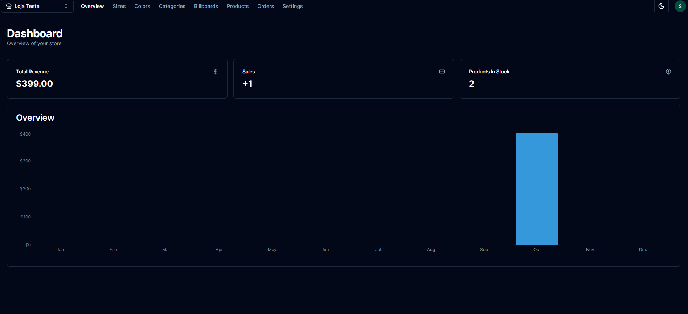

# Ecommerce Frontend

## Overview

This is a ecommerce frontend application.


## Technologies Used

- **NextJS 13**: For building the user interface.
- **TailwindCSS**: For styling the components.
- **TypeScript**: For adding static type-checking along with the latest ECMAScript features.
- **ESLint**: To enforce a consistent coding style and find problems in the code.
- **React-hook-form**: For managing form state and validation.
- **Axios**: Managing the API calls.
- **Lucide-react**: For icons.
- **React-hot-toast**: For toast animations.
- **Zustand**: A small, fast, and scalable bearbones state-management solution using simplified flux principles.
- **@radix-ui/react**: A collection of low-level UI primitives.
- **@tanstack/react-table**: For creating tables.
- **date-fns**: JavaScript date utility library.
- **next-themes**: For theme management in Next.js.
- **recharts**: For charting and graphing.
- **zod**: For building and validating data schemas.
- **stripe**: For payment processing.
- **@prisma/client**: Data client for Prisma.
- **@clerk/nextjs**: For Clerk integration in Next.js (Authentication).
- **next-cloudinary**: For cloudinary integration in Next.js.
- **clsx**: For conditionally applying classNames.
- **shadcn-ui**: UI components.
- **tailwind-merge**: Helper for merging Tailwind CSS class strings.
- **tailwindcss-animate**: For animations in TailwindCSS.

## Getting Started

### Prerequisites

- Node.js
- npm or Yarn
- You must have all the keys see the .env.example
- Create a primsa, stripe, clerk, cloudinary.
- Using planetscale to vizualize the database.

### Installation

1. Clone the repository:

```
git clone https://github.com/samueloh99/ecommerce-admin.git
```

2. Navigate to the project directory:

```
cd ecommerce-admin
```

2. Install NPM packages:

```
npm install
or
yarn install
```

3. Start the development server:

```
npm dev
or
yarn dev
```

## Contributing

Contributions are what make the open-source community such an amazing place to learn, inspire, and create. Any contributions you make are **greatly appreciated**.

1. Fork the Project
2. Create your Feature Branch (`git checkout -b feature/AmazingFeature`)
3. Commit your Changes (`git commit -m 'Add some AmazingFeature'`)
4. Push to the Branch (`git push origin feature/AmazingFeature`)
5. Open a Pull Request

## License

Distributed under the MIT License. See `LICENSE` for more information.

## Contact

Samuel Oh - [samueloh99@gmail.com](mailto:samueloh99@gmail.com)

Live Project Link: https://ecommerce-admin-samueloh9.vercel.app/
